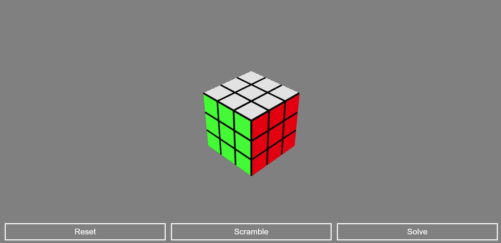
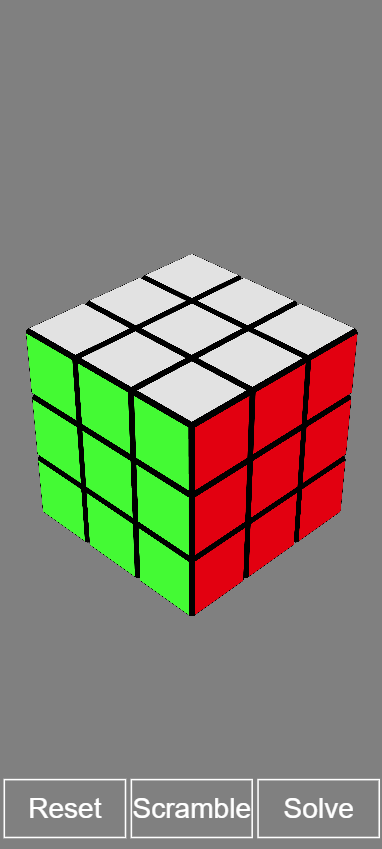

# Rubik’s Cube 3D

> A fully interactive, Three.js-powered Rubik’s Cube built for the web — featuring scramble, solve (via the Kociemba algorithm), and reset functionality. Playable on desktop *and* mobile!

[](https://threejs.org/)
[](https://pages.github.com/)
[](./LICENSE)

---

## 🎮 Live Demo

**Play it here:** [https://logantackett1.github.io/rubiks-threejs](https://logantackett1.github.io/rubiks-threejs)

The cube is fully **playable** and works smoothly across devices.

| Desktop | Mobile |
|----------|---------|
|  |  |

---

## ✨ Features

- 🧊 **Interactive 3D Cube** – Rotate, drag, and manipulate the cube in real-time.
- 🎲 **Scramble Button** – Generates a random, solvable scramble.
- 🧠 **Solve Button** – Automatically solves the cube using the **Kociemba algorithm**.
- 🔄 **Reset Button** – Instantly returns the cube to a solved state.
- 📱 **Mobile Compatibility** – Responsive controls for touch devices.
- ⚡ **High Performance** – Powered by Three.js and WebGL for smooth rendering.

---

## 🧱 Architecture Overview

- **Frontend Framework:** Vanilla JavaScript + Three.js  
- **Bundler:** Webpack  
- **Entry Point:** `src/index.js`  
- **Output:** `dist/main.js`  
- **Deployment:** GitHub Pages (`gh-pages` branch)

```plaintext
[src/index.js] → [webpack] → [dist/main.js] → [GitHub Pages]
```

---

## 🚀 Deployment (GitHub Pages)

This app is deployed via **GitHub Pages**, making it fast and serverless.

### 1. Build the Project

```bash
npm install
npm run build
```

This compiles everything into the `dist/` folder.

### 2. Deploy to GitHub Pages

If you already have the `gh-pages` branch set up:

```bash
npm run deploy
```

Otherwise, install the package and initialize:

```bash
npm install gh-pages --save-dev
npx gh-pages -d dist
```

This will publish your `dist/` folder directly to your GitHub Pages site.

> 📝 **Note:** Make sure your repository name matches the deployed URL (`https://<username>.github.io/<repo-name>`).

---

## 🧰 Local Development

Run locally with hot reload for testing and tweaking visuals:

```bash
npm install
npm start
```

Then open [http://localhost:8080](http://localhost:8080) in your browser.

---

## 🔍 File Structure

```plaintext
rubiks-threejs/
├── src/
│   ├── index.html
│   ├── index.js
│   └── styles.css
├── dist/
│   ├── index.html
│   └── main.js
├── package.json
├── webpack.config.js
└── README.md
```

---

## 🧠 Credits

- **Three.js** – for the 3D rendering engine  
- **Kociemba Algorithm** – for cube-solving logic  
- **Logan Tackett** – developer & designer

---

## 🗺️ Roadmap

- [ ] Add move notation display (U, D, L, R, F, B)
- [ ] Timed solve tracking
- [ ] Optional color themes
- [ ] Save/Load cube states

---

## 📜 License

MIT License — free to use, modify, and deploy.
